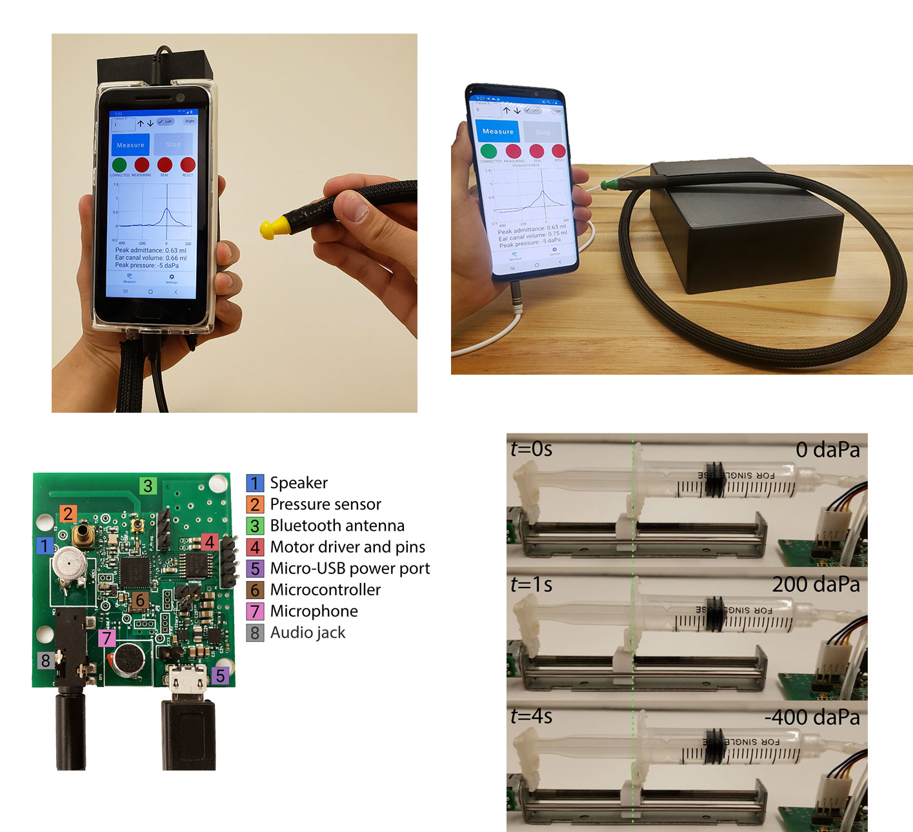
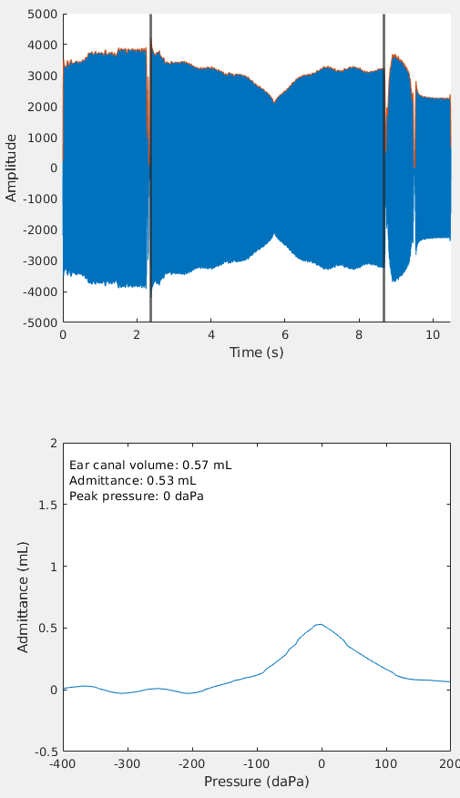

## Overview

This repository contains a the hardware design (schematic and PCB), and software required to build the open source tympanometer system. 

## Hardware
* [Schematic](hardware/TYMP_PCB_V1.pdf)
* [PCB design files](hardware/pcb.zip)
* [BOM](hardware/Bill of Material.xlsx)

The PCB project can be opened using Altium Designer.

## Microcontroller code
The [code](mcu/examples/ble_peripheral/tymp_blechip_code) runs on Nordic Semiconductor nRF52832 and can be viewed with Segger Embedded Studio.

## Smartphone code
The [code](phone/) is an Android Studio project.

## Demo
We have added a MATLAB demo showing how to process the audio and pressure signals recorded by the system and output a tympanogram.

These scripts were originally run on:
* Ubuntu 18.04.5
* MATLAB R2021a

The programs should be able to run even if the versions do not exactly match.

No non-standard hardware is required to run these programs.

### Programs
Running this programs will generate the tympanogram for a sample tympanometry measurement.

* demo.m: This file processes the acoustic and pressure data recorded by the system to produce a tympanogram.

### Data:
* mout.txt: Audio recording from smartphone.
* pout.txt: Pressure sensor recording from microcontroller.
* sout.txt: Timestamp recording from smartphone.

### Instructions to run demo

Run 'demo.m' in MATLAB

Runtime: 1.019325 seconds

The output is the following figure.

The first subplot shows the the band-passed acoustic signal, and the points of maximum and minimum air pressure in the ear.
The second subplot shows the resultant tympanogram as well as the ear canal volume, admittance, and peak pressure values.

## Contributors
- [Justin Chan](https://homes.cs.washington.edu/~jucha/)
- [Ali Najafi](https://anajafi.com/)
